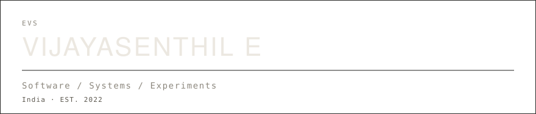
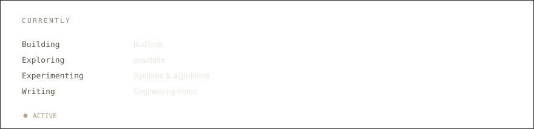
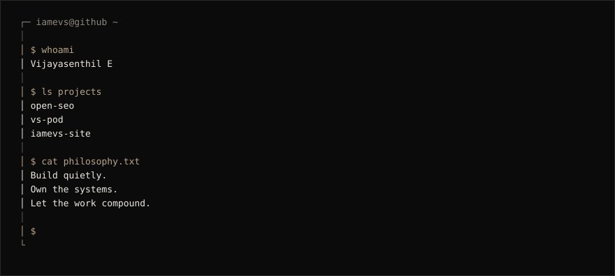
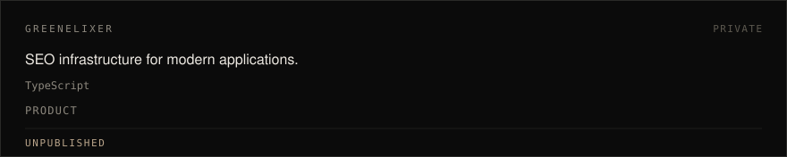
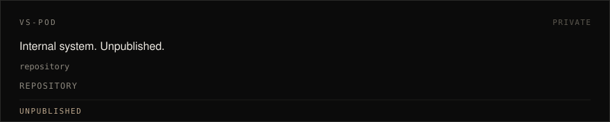
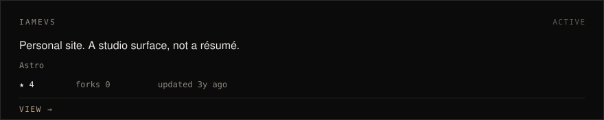
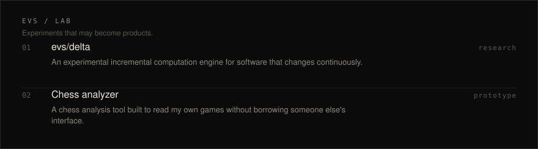
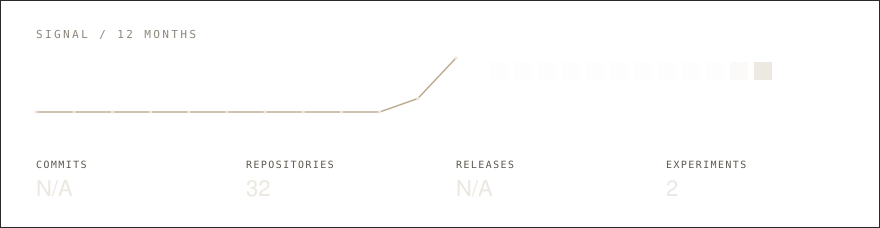
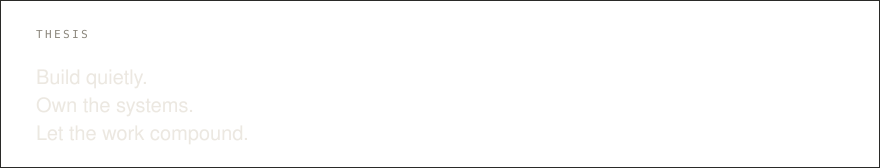

<body style="background: black !important;">

<picture>
  <source media="(prefers-color-scheme: dark)" srcset="generated/header-dark.svg">
  <source media="(prefers-color-scheme: light)" srcset="generated/header-light.svg">
  
</picture>

<em>I build software, systems, and experiments.</em>

<a href="#about">ABOUT</a>&nbsp;&nbsp;&nbsp;&nbsp;<a href="#work">WORK</a>&nbsp;&nbsp;&nbsp;&nbsp;<a href="#lab">LAB</a>&nbsp;&nbsp;&nbsp;&nbsp;<a href="#signal">SIGNAL</a>&nbsp;&nbsp;&nbsp;&nbsp;<a href="#writing">WRITING</a>

<picture>
  <source media="(prefers-color-scheme: dark)" srcset="generated/currently-dark.svg">
  <source media="(prefers-color-scheme: light)" srcset="generated/currently-light.svg">
  
</picture>

<picture>
  <source media="(prefers-color-scheme: dark)" srcset="generated/terminal-dark.svg">
  <source media="(prefers-color-scheme: light)" srcset="generated/terminal-light.svg">
  
</picture>

<picture>
  <source media="(prefers-color-scheme: dark)" srcset="generated/project-open-seo-dark.svg">
  <source media="(prefers-color-scheme: light)" srcset="generated/project-open-seo-light.svg">
  
</picture>

<picture>
  <source media="(prefers-color-scheme: dark)" srcset="generated/project-vs-pod-dark.svg">
  <source media="(prefers-color-scheme: light)" srcset="generated/project-vs-pod-light.svg">
  
</picture>

<a href="https://www.iamevs.com">
<picture>
  <source media="(prefers-color-scheme: dark)" srcset="generated/project-iamevs-site-dark.svg">
  <source media="(prefers-color-scheme: light)" srcset="generated/project-iamevs-site-light.svg">
  
</picture>
</a>

<picture>
  <source media="(prefers-color-scheme: dark)" srcset="generated/lab-dark.svg">
  <source media="(prefers-color-scheme: light)" srcset="generated/lab-light.svg">
  
</picture>

<a href="https://github.com/iamevs-lab/delta">evs/delta</a>&nbsp;&nbsp;·&nbsp;&nbsp;<a href="https://www.iamevs.com">Chess analyzer</a>

<picture>
  <source media="(prefers-color-scheme: dark)" srcset="generated/signal-dark.svg">
  <source media="(prefers-color-scheme: light)" srcset="generated/signal-light.svg">
  
</picture>

<h2>Build Log</h2>

| Date | Surface | Note |
| :--- | :--- | :--- |
| `2026.09.13` | [evs/delta](https://github.com/iamevs-lab/delta) | opened the laboratory |
| `2022.01.17` | [iamevs](https://github.com/iamevs) | established the public record |

<h2>Writing</h2>

Notes will appear here when they are ready to leave the notebook.

<picture>
  <source media="(prefers-color-scheme: dark)" srcset="generated/thesis-dark.svg">
  <source media="(prefers-color-scheme: light)" srcset="generated/thesis-light.svg">
  
</picture>

<h2>Connect</h2>

<a href="https://github.com/iamevs">GitHub</a>&nbsp;&nbsp;·&nbsp;&nbsp;<a href="https://github.com/iamevs-lab">Lab</a>&nbsp;&nbsp;·&nbsp;&nbsp;<a href="https://www.iamevs.com">Website</a>&nbsp;&nbsp;·&nbsp;&nbsp;<a href="mailto:e.vijayasenthil@gmail.com">Email</a>&nbsp;&nbsp;·&nbsp;&nbsp;<a href="https://linkedin.com/in/iamevs">LinkedIn</a>&nbsp;&nbsp;·&nbsp;&nbsp;<a href="https://x.com/i_am_evs_">X</a>

EVS / 2026

</body>